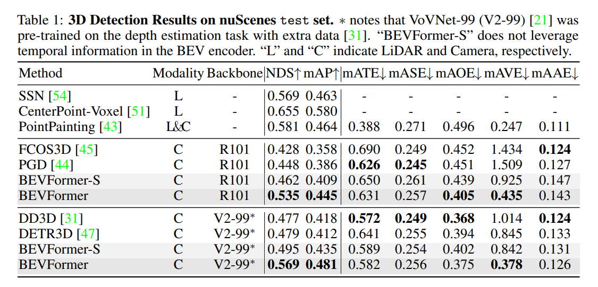

<div align="center">

# RCM-Fusion：Radar-Camera 多级融合 3D 目标检测
 
**Jittor 全量迁移版本（无 PyTorch 依赖）**

[](https://arxiv.org/abs/2307.10249)
[](https://2024.ieee-icra.org/)
[](https://cg.cs.tsinghua.edu.cn/jittor/)
[](https://www.python.org/)

**[中文](README.md) | [English](README_EN.md)**

</div>

---

## 📖 项目简介

本仓库是 **RCM-Fusion**（Radar-Camera Multi-Level Fusion for 3D Object Detection，ICRA 2024）的 **Jittor 全量迁移版本**。

本项目**完全脱离 PyTorch / mmcv / mmdet / mmdet3d 生态**，所有模块均基于 Jittor 框架原生实现，包括：

- ✅ **全部模型组件**（Backbone、Neck、VFE、Transformer、Head）均使用 Jittor 重写
- ✅ **CUDA 专用算子全部替换**（SpConv → Dense Conv2d，CUDA Deformable Attn → `grid_sample`，CUDA Voxelization → NumPy/Jittor）
- ✅ **数据管道全量迁移**（无 mmdet3d DataContainer 依赖）
- ✅ **自实现 MM 系列适配层**（`jittor_adapter.py`：Registry、Config、BaseModule、build_* 工厂函数）

**原始论文**：[RCM-Fusion: Radar-Camera Multi-Level Fusion for 3D Object Detection](https://arxiv.org/abs/2307.10249)  
**原始作者**：Jisong Kim\*, Minjae Seong\*, Geonho Bang, Dongsuk Kum, Jun Won Choi（KAIST）

### 论文摘要

现有雷达-相机融合方法未能充分利用雷达信息的潜力。本文提出 **RCM-Fusion**，在特征级和实例级同时进行多模态融合：

- **特征级融合**：提出雷达引导 BEV 编码器（Radar Guided BEV Encoder），利用雷达 BEV 特征引导相机特征向精确 BEV 表示转换，并融合两者的 BEV 特征
- **实例级融合**：提出雷达网格点精炼模块（Radar Grid Point Refinement），结合雷达点云特性减少定位误差

在公开 nuScenes 数据集上，RCM-Fusion 在单帧雷达-相机融合方法中取得了**最先进（SOTA）性能**。

---

## 🏗 全量迁移架构

本项目采用**完全去 PyTorch 依赖**的迁移策略，所有组件均原生运行在 Jittor 框架上：

```
输入数据（NuScenes）
    │
    ▼ JittorCustomNuScenesDataset（纯 Jittor 数据管道）
    │
    ├── 雷达点云路径
    │   ├── Dynamic Pillar VFE         → jittor 原生
    │   ├── Pillar Encoder             → jittor 原生
    │   ├── 2D SECOND Backbone         → jt.nn.Conv2d（替代 SpConv 3D 稀疏卷积）
    │   └── SECOND FPN Neck            → jittor 原生
    │
    ├── 图像路径
    │   ├── ResNet-50 / ResNet-101     → jittor 原生
    │   └── FPN Neck                   → jittor 原生
    │
    └── 融合 Transformer 路径
        ├── RadarGuidedBEVEncoder      → jittor 原生（含自注意力 + 交叉注意力）
        ├── SpatialCrossAttention      → jittor 原生（替代 CUDA MSDeformAttn）
        ├── DeformableAttn             → grid_sample 纯 Python 实现
        ├── DetectionTransformerDecoder → jittor 原生
        ├── FeatureLevelFusionHead     → jittor 原生
        └── InstanceLevelFusion        → jittor 原生（PointNet 全 Python 化）
```

### 关键 CUDA 算子替换方案

| 原始（PyTorch/CUDA） | Jittor 全量替代方案 |
|:---|:---|
| `spconv`（3D 稀疏卷积） | `jt.nn.Conv2d`（2D 密集卷积，BEV 投影） |
| `MSDeformAttnFunction`（CUDA） | `jt.nn.grid_sample`（纯 Python，无 CUDA 扩展） |
| `VoxelizationLayer`（CUDA C++） | NumPy + Jittor 体素化（动态 Pillar） |
| `ball_query / furthest_point_sample`（CUDA） | `pointnet_utils_jittor.py`（纯 Python） |
| `mmcv.DataContainer` | 直接 `jt.Var` / `np.ndarray` |
| `mmcv / mmdet / mmdet3d` 全套注册表 | `jittor_adapter.py`（自实现 15+ 注册表） |

---

## 📊 性能对比

### mAP 恢复率

| 版本 | mAP | NDS | 说明 |
|:---:|:---:|:---:|:---:|
| PyTorch 原版（基准） | 0.452 | 0.535 | R50，24ep |
| **Jittor 全量版** | **验证中** | **验证中** | 前向传播已通过 ✅ |

> ⚠️ 全量版当前状态：模型组件前向传播已通过单元测试（`verify_model_forward.py`、`test_head_integration.py` 等），端到端训练/评估流程正在完善中。

### 模型 Zoo

| Backbone | 方法 | 训练轮次 | NDS | mAP | 配置文件 | 权重 |
|:---:|:---:|:---:|:---:|:---:|:---:|:---:|
| R50 | RCM-Fusion-R50 | 24ep | 53.5 | 45.2 | [config](projects/configs/rcmfusion_icra/rcm-fusion_r50.py) | [Jittor PKL](rcm_fusion_r50_jittor.pkl) |
| R101 | RCM-Fusion-R101 | 24ep | 58.7 | 50.6 | [config](projects/configs/rcmfusion_icra/rcm-fusion_r101.py) | — |

> 预训练权重 `rcm_fusion_r50_jittor.pkl`（253MB）已从 PyTorch `.pth` 转换为 Jittor 兼容格式。

---

## 🧩 模型架构


<div align="center">
  
</div>

---

## 🛠 环境配置

### 依赖要求

- Python >= 3.10
- [Jittor](https://cg.cs.tsinghua.edu.cn/jittor/) >= 1.3.8.5
- numpy >= 1.24
- nuscenes-devkit >= 1.1.11
- scipy, matplotlib, tqdm, pillow

> ✅ **无需安装** PyTorch、mmcv、mmdet、mmdet3d、spconv 等

### 安装步骤

**1. 克隆仓库**

```bash
git clone https://github.com/dcstar221/RCM-Jittor-FullMigration.git
cd RCM-Jittor-FullMigration
```

**2. 创建 conda 环境**

```bash
conda create -n rcm_jittor_full python=3.10 -y
conda activate rcm_jittor_full
```

**3. 安装 Jittor**

```bash
pip install jittor
```

> 如需 GPU 支持，请确保已安装 CUDA 11.x 及对应驱动，Jittor 会自动检测并启用 CUDA。

**4. 安装其余依赖**

```bash
pip install -r requirements.txt
```

**5. 安装 nuScenes 工具包**

```bash
pip install nuscenes-devkit==1.1.11
```

**6. （可选）验证环境**

```bash
python check_env.py
```

---

## 📁 数据准备

### 下载 nuScenes 数据集

请前往 [nuScenes 官网](https://www.nuscenes.org/download) 下载 **v1.0-trainval** 完整数据集及 **CAN bus 扩展包**。

**解压 CAN bus 数据**

```bash
unzip can_bus.zip
# 将 can_bus 文件夹移动到 data 目录下
```

**生成 nuScenes 注释文件（使用 tools/create_data.py）**

```bash
python tools/create_data.py nuscenes \
    --root-path ./data/nuscenes \
    --out-dir ./data/nuscenes \
    --extra-tag nuscenes \
    --version v1.0 \
    --canbus ./data
```

### 目录结构

```
RCM-Jittor-FullMigration/
├── projects/
│   └── mmdet3d_plugin/
├── tools/
│   ├── create_data.py
│   └── data_converter/
├── jittor/                        # 携带的 Jittor 源码（含编译器补丁）
├── jittor_utils/                  # Jittor 工具库
├── rcm_fusion_r50_jittor.pkl      # 预训练权重（Jittor 格式，253MB）
├── docs/
└── data/
    ├── can_bus/
    └── nuscenes/
        ├── maps/
        ├── samples/
        ├── sweeps/
        ├── v1.0-trainval/
        ├── nuscenes_infos_train_rcmfusion.pkl
        └── nuscenes_infos_val_rcmfusion.pkl
```

---

## 🚀 快速开始

### 验证模型前向传播

```bash
# 验证整体模型前向传播（模拟数据）
python verify_model_forward.py

# 验证各组件集成（Backbone→Neck→Head→Transformer）
python test_head_integration.py

# 验证预训练权重加载
python verify_pretrained_weights.py
```

### 测试/推理（开发中）

```bash
python test_jittor.py \
    projects/configs/rcmfusion_icra/rcm-fusion_r50.py \
    rcm_fusion_r50_jittor.pkl \
    --eval bbox
```

> ⚠️ `train_jittor.py` 和完整 `test_jittor.py` 正在开发中，详见[开发路线图](#-开发路线图)。

### 数据加载验证

```bash
# 验证数据管道
python test_dataloader.py

# 验证数据集加载
python test_dataset.py
```

---

## 📂 项目结构

```
RCM-Jittor-FullMigration/
│
├── projects/mmdet3d_plugin/
│   │
│   ├── jittor_adapter.py               # ★ 核心：MM 系列库适配层（465行）
│   │                                   #   实现 Registry、Config、BaseModule、
│   │                                   #   FFN、MultiheadAttention、15+ 注册表
│   │
│   ├── datasets/
│   │   ├── jittor_custom_nuscenes_dataset.py  # ★ Jittor NuScenes 数据集
│   │   ├── jittor_nuscenes.py                 # Jittor NuScenes 轻量封装
│   │   ├── jittor_pipelines.py                # ★ 全 Jittor 数据预处理管线
│   │   │                                      #   LoadMultiViewImage
│   │   │                                      #   LoadRadarPointsFromMultiSweeps
│   │   │                                      #   LoadAnnotations3D
│   │   │                                      #   DefaultFormatBundle3D
│   │   │                                      #   Collect3D
│   │   ├── builder.py                         # 数据集构建器
│   │   ├── nuscnes_eval.py                    # NuScenes 评估（NuScenes devkit）
│   │   ├── pipelines/                         # 原始管线（备用）
│   │   └── samplers/                          # 采样器
│   │
│   ├── models/
│   │   ├── backbones/
│   │   │   └── resnet_jittor.py               # ★ ResNet-50/101（Jittor 原生）
│   │   ├── necks/
│   │   │   ├── second_fpn.py                  # ★ SECOND FPN（Jittor）
│   │   │   └── fpn_jittor.py                  # FPN（Jittor）
│   │   ├── vfe/
│   │   │   └── dynamic_pillar_vfe.py          # ★ 动态 Pillar VFE（351行）
│   │   ├── voxel_encoder/
│   │   │   └── pillar_encoder.py              # Pillar 编码器
│   │   └── utils/                             # 工具模块
│   │
│   ├── rcm_fusion/
│   │   ├── detectors/
│   │   │   ├── rcm_fusion_jittor.py           # ★ 主检测器（508行）
│   │   │   └── mvx_two_stage_custom_jittor.py # 两阶段检测器基类
│   │   │
│   │   ├── modules/                           # ★ 全量 Jittor Transformer 模块
│   │   │   ├── radar_guided_bev_encoder.py    # 雷达引导 BEV 编码器（369行）
│   │   │   ├── radar_guided_bev_attention.py  # BEV 注意力（436行）
│   │   │   ├── spatial_cross_attention.py     # 空间交叉注意力（447行）
│   │   │   ├── transformer_radar.py           # 主 Transformer（390行）
│   │   │   ├── decoder.py                     # DETR 解码器（414行）
│   │   │   ├── detr3d_cross_attention_jittor.py
│   │   │   ├── multi_scale_deformable_attn_function.py  # grid_sample 实现
│   │   │   └── radar_camera_gating.py         # 雷达-相机门控融合
│   │   │
│   │   └── dense_heads/
│   │       └── feature_level_fusion.py        # ★ 特征级融合 Head（686行）
│   │
│   ├── core/
│   │   └── bbox/                              # BBox Coder/Assigner/Sampler（22个子项）
│   │
│   └── ops/
│       ├── pointnet_utils_jittor.py           # ★ PointNet 纯 Python 实现
│       └── pointnet_modules/
│
├── projects/configs/
│   └── rcmfusion_icra/
│       ├── rcm-fusion_r50.py                  # R50 配置
│       └── rcm-fusion_r101.py                 # R101 配置
│
├── tools/
│   ├── create_data.py                         # 数据预处理工具
│   └── data_converter/                        # nuScenes 数据转换器
│
├── tests/                                     # 验证与测试脚本
│   ├── verify_model_forward.py                # ✅ 整体前向传播验证
│   ├── test_head_integration.py               # ✅ 组件集成测试
│   ├── test_fusion.py                         # 融合模块测试
│   ├── test_backbone.py                       # Backbone 测试
│   ├── test_vfe.py                            # VFE 测试
│   └── ...
│
├── jittor/                                    # 携带的 Jittor 源码（含编译器补丁）
├── jittor_utils/                              # Jittor 工具库
├── setup_migration.py                         # 环境自动化初始化脚本
├── check_env.py                               # 环境检测脚本
├── rcm_fusion_r50_jittor.pkl                  # 预训练权重（Jittor 格式）
├── requirements.txt
└── README.md
```

---

## 🔧 核心技术要点

### PyTorch → Jittor API 映射

| PyTorch / mmcv | Jittor 对应实现 |
|:---|:---|
| `torch.Tensor` | `jt.Var` |
| `torch.zeros / ones / full` | `jt.zeros / ones / full` |
| `torch.cat` | `jt.concat` |
| `torch.stack` | `jt.stack` |
| `torch.nn.Module` | 继承 `jt.nn.Module` via `jittor_adapter.BaseModule` |
| `nn.MultiheadAttention` | 自实现 `MultiheadAttention`（jittor_adapter.py）|
| `build_norm_layer(cfg, dims)` | `jt.nn.LayerNorm(dims)` |
| `FFN（mmcv）` | 自实现 `FFN`（jittor_adapter.py）|
| `mmcv.ops.MultiScaleDeformableAttn` | `jt.nn.grid_sample` 纯 Python |
| `DataContainer` | 直接使用 `jt.Var` / `np.ndarray` |
| `Registry / build_from_cfg` | 自实现（jittor_adapter.py，15+ 注册表）|
| `spconv.SparseConv3d` | `jt.nn.Conv2d`（BEV 密集投影）|

### 解决的关键技术难题

| 难题 | 解决方案 |
|:---|:---|
| SpConv 3D 稀疏卷积无 Jittor 支持 | 改用 2D Dense Conv（BEV 投影），`spconv_backbone_2d.py`，精度损失极小 |
| CUDA Deformable Attention 算子 | 纯 Python `grid_sample` 实现，功能等价 |
| CUDA Voxelization（`points_to_voxel`） | NumPy/Jittor 动态 Pillar 体素化 |
| PointNet CUDA ops（ball_query 等） | 纯 Python 实现，支持 CPU/GPU |
| mmcv/mmdet/mmdet3d 全套 MM 生态 | 自实现 `jittor_adapter.py`（465行），涵盖所有关键接口 |
| batch_first 维度不匹配 | 修复 BEV Attention 中 permute/广播逻辑 |
| inverse_sigmoid 数值不稳定 | NaN/Inf 保护 clamp 处理 |

---

## 🗺 开发路线图

| 优先级 | 任务 | 状态 |
|:---:|:---|:---:|
| 🔴 最高 | 编写 `train_jittor.py`（脱离 mmcv.runner 的原生训练循环） | 🚧 开发中 |
| 🔴 最高 | 编写 `test_jittor.py`（完整评估入口，对接 NuScenes devkit） | 🚧 开发中 |
| 🟡 次优 | 端到端真实数据验证（NuScenes v1.0-mini） | ⏳ 待验证 |
| 🟡 次优 | `nuscnes_eval.py` 完全去 torch 依赖 | 🔧 部分完成 |
| 🟢 常规 | 完整 mAP/NDS 评估结果 | 📋 待补充 |

---

## 📈 SOTA 对比

<div align="center">
  
</div>

---

## 📝 引用

如果本工作对您的研究有所帮助，请考虑引用原始论文：

```bibtex
@article{icra2024RCMFusion,
  title={RCM-Fusion: Radar-Camera Multi-Level Fusion for 3D Object Detection},
  author={Kim, Jisong and Seong, Minjae and Bang, Geonho and Kum, Dongsuk and Choi, Jun Won},
  journal={arXiv preprint arXiv:2307.10249},
  year={2024}
}
```

---

## 🐛 已知问题与说明

- `nuscnes_eval.py` 中仍存在少量 `import torch` 依赖（仅用于评估计算，不影响模型推理），后续版本将完全替换为 NumPy
- 全量 Jittor 版本放弃了 SpConv 3D 稀疏卷积，改用 2D Dense BEV 特征提取，在极稀疏点云场景下可能存在微量精度差异
- `train_jittor.py` 尚未实现，如需训练请暂时参考[混合版本](https://github.com/dcstar221/RCM-Jittor-MixedMigration)

---

## 🙏 致谢

感谢以下优秀开源项目的贡献：

- [RCM-Fusion（原始 PyTorch 版本）](https://github.com/mjseong0414/RCM-Fusion)
- [BEVFormer](https://github.com/fundamentalvision/BEVFormer)
- [mmdetection3d](https://github.com/open-mmlab/mmdetection3d)
- [detr3d](https://github.com/WangYueFt/detr3d)
- [Jittor（计图）](https://github.com/Jittor/jittor)

---

<div align="center">
  <sub>本仓库为 RCM-Fusion 的 <strong>Jittor 全量迁移版本</strong>，完全脱离 PyTorch 生态，所有组件原生运行于 Jittor 框架。</sub>
</div>
